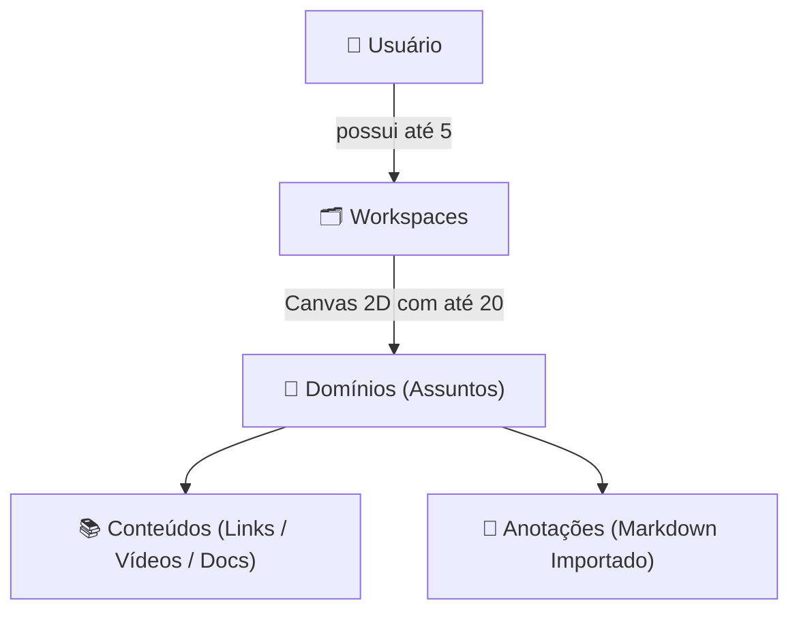

# ⚡ Dynamo

> Centralize e organize seus estudos através de uma estrutura visual interativa em Canvas 2D.

---

## O que é o Dynamo?

Ao estudar temas complexos (como Linux, Redes, Arquitetura de Software ou novas linguagens), é comum nos depararmos com materiais dispersos: vídeos no YouTube, cursos em plataformas variadas, documentações oficiais abertas em dezenas de abas e anotações locais no Obsidian.

O **Dynamo** surge para criar uma camada visual e organizada sobre todo esse ecossistema, conectando **conteúdos externos** e **anotações importadas** em um único lugar, sem aprisionamento:
- Suas anotações continuam sendo arquivos seus na sua máquina.
- Os vídeos, artigos e documentações continuam disponíveis na internet.
- O Dynamo fornece o mapa visual que conecta tudo isso com significado e contexto.

---

## Como Funciona (Conceitos Centrais)



### 1. Workspaces (Espaços de Estudo)
- Cada usuário pode criar até **5 workspaces** independentes (ex: *Ciência da Computação*, *DevOps*, *Idiomas*).
- Área de trabalho baseada em um **Canvas 2D espacial**, com movimentação livre (pan) e controle de zoom.
- Posição da câmera, zoom e layout dos domínios são **persistidos automaticamente**.
- Suporte a paletas de cores e temas específicos por Workspace.

### 2. Domínios (Nós de Conhecimento)
- Representam tópicos específicos de estudo posicionados livremente no canvas (até **20 por workspace**).
- Podem ser interconectados com **relacionamentos visuais** (linhas neutras ou setas direcionais indicando fluxo e dependência visual).
- Ao selecionar um domínio, uma **Sidebar lateral** é aberta com duas seções principais:
  - **📚 Conteúdos:** Links categorizados (Vídeos, Cursos, Documentações, Artigos, Outros) com ordenação personalizada e descrição destacada no topo.
  - **📝 Anotações:** Importação direta de arquivos `.md` (ex: exportados do Obsidian), adaptados para HTML e apresentados em fluxo contínuo.

### 3. Modos de Operação
- **Modo Leitura:** Foco no consumo e consulta dos materiais e anotações.
- **Modo Edição:** Permite gerenciar/reordenar conteúdos, adicionar links e importar novas anotações.
- A movimentação de domínios e a navegação no Canvas permanecem livres em ambos os modos.

### 4. Busca Contextual
- Pesquisa rápida focada no workspace atual, localizando termos em nomes de domínios, títulos de conteúdos e texto das anotações, com navegação direta até a ocorrência.

---

## Stack Tecnológica

| Camada | Tecnologias |
| :--- | :--- |
| **Linguagem** | TypeScript (Frontend e Backend) |
| **Backend** | Node.js, Express 5, Zod (validação), Winston (logs), JWT & Bcrypt |
| **Frontend** | React 19, React Compiler, Vite, Tailwind CSS v4 |
| **Banco de Dados** | PostgreSQL |
| **Testes** | Vitest, Supertest, React Testing Library, Playwright |
| **Deploy** | Railway (Backend + Postgres) e Vercel (Frontend) |

---

## Filosofia do Projeto: Simplicidade Pragmática

O Dynamo é um projeto pessoal desenvolvido com foco em **aprendizado prático full-stack**.

A arquitetura do projeto segue o princípio de **clareza e simplicidade**:
- Separação coerente de responsabilidades sem fragmentação excessiva.
- Evitar sobre-engenharia ou abstrações desnecessárias para problemas que o projeto ainda não possui.
- Foco em boas práticas reais: tipagem estrita, validação de entrada, tratamento robusto de erros, segurança e testes automatizados.

---

## Estrutura do Repositório

```text
Dynamo/
├── backend/                # API REST em Node.js/Express
│   ├── src/
│   │   ├── config/         # Configurações (DB, CORS, Rate Limit, Env)
│   │   ├── middlewares/    # Middlewares (Auth, Validação Zod, Erros, Logs)
│   │   ├── routes/         # Endpoints da API (v1)
│   │   ├── types/          # Tipagens TypeScript e contratos
│   │   ├── utils/          # Handlers e formatadores utilitários
│   │   └── tests/          # Testes unitários e de integração
│   └── package.json
│
├── frontend/               # SPA em React + Vite + Tailwind
│   ├── src/
│   │   ├── config/         # Configurações de ambiente
│   │   ├── types/          # Interfaces e tipos compartilhados
│   │   └── App.tsx
│   └── package.json
│
└── docs/                   # Documentação detalhada de produto e arquitetura
    └── db/                 # Schemas e definições SQL
```

---

## Roadmap de Desenvolvimento

- [x] **Autenticação & Usuários:** Cadastro, login, tokens de sessão e perfil no backend.
- [ ] **Módulo de Workspaces:** CRUD de workspaces, limites de usuário e persistência de layout/câmera.
- [ ] **Canvas Interativo (Frontend):** Navegação 2D, pan/zoom e renderização de nós de Domínio.
- [ ] **Sidebar do Domínio:** Gerenciador de Conteúdos com filtros por tipo.
- [ ] **Importador de Markdown:** Conversão e visualização contínua de notas.
- [ ] **Busca Contextual:** Mecanismo de busca indexada no Workspace ativo.

---

## Licença

Este projeto é desenvolvido para fins de estudo e aprendizado pessoal.